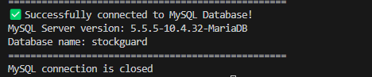
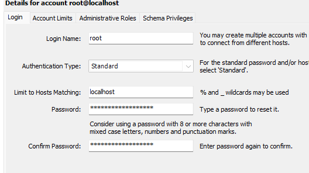

# Stock Guard - Invertory Management System

Stock Guard is a lightweight inventory maangemnt system build using Flask and MySQL

## Features:
- Role-based login for manager and store admin
- Supplier management 🚚
- Category management 🏷️
- Store manangement  🏪
- Product managemnt 📦
- User managemnt 👥
- Role-based dashboard for manager and store admin 🌍
- Reporting 📊
- Low stock alert notifications 

## Technology:
- Frontend : HTML, CSS( Bootstrap ), Javascript
- Backend : Python,Flask
- Database : MySQL
- Other tools : Jira ( for planning ) GitHub ( version control ), Xampp ( for database setup and testing )

### Getting Started

- MySQL workbench
- Python 
- Pip 

### Pip install item
- Python-dotenv
- Render template
- Flask
- Mysql-connector-python
- Werkzeug.security

#### Installationn

1. Clone the repository 
2. Pip install necessary dependencies.
3. Install XAMPP 
4. Set up MySQL database and check on the .env folder as stored the senstive information.
5. Need copy the .env file path and paste to the env path on database.py and test_database.py 
6. One of connection and one for test database result. 
7. On the MySql Workbench need to settings >> user root from host localhost this account change password to given inside .env file 
8. Copy all SQL queries from schema.sql then run it 
9. Enter default password have stored in databse
10. Run the System
11. Manager role default username and passowrd is Manager , 122397 

##### Trobleshooting 
-  Cant connect to MySQL?
- Ensure XAMPP MySQL service is running,
- Check on database credential in .env and run the test_database.py
 Result show
 

- connect to MySQL but facing error connection issue 

- ensure change the user password 
- re-run the test_database

- Flask Not found ?
- Make suru install via pip install flask 

###### License
- This project is part of CE301 individual final-year proejct and is intended for academic and eductional use.